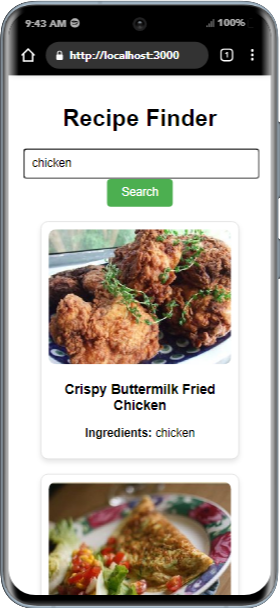

# Recipe Finder

A React app that helps users discover recipes based on ingredients they have at home. This app uses the Spoonacular API to fetch recipes and allows users to browse recipe details such as ingredients and instructions.

## Demo

You can view the live demo of the app here: [Recipe Finder Demo](https://recipe-finder-app-pink.vercel.app/)



## Features

- **Search by Ingredients**: Enter a list of ingredients to find recipes.
- **Pagination**: Browse through recipes with pagination (10 results per page).
- **Recipe Details**: Click on a recipe to view detailed instructions.
- **Loading State**: Displays a loading message while fetching recipes.
- **Error Handling**: Displays an error message if fetching recipes fails.

## Technologies Used

- **React**: For building the user interface.
- **Spoonacular API**: For fetching recipe data.
- **Axios**: For making HTTP requests to the API.
- **CSS**: For styling the app.

## Prerequisites

- Node.js (v14 or later)
- npm (v6 or later) or yarn

## Setup Instructions

### 1. Clone the Repository

```bash
git clone https://github.com/thapeloboya/recipe-finder.git
cd recipe-finder
